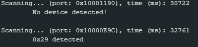
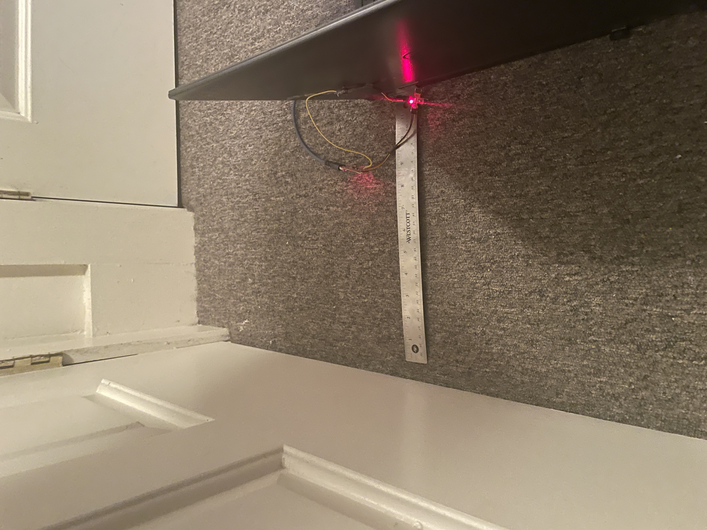
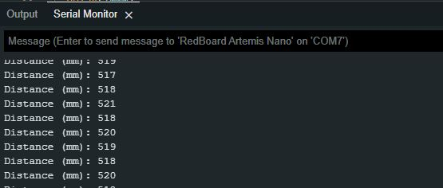
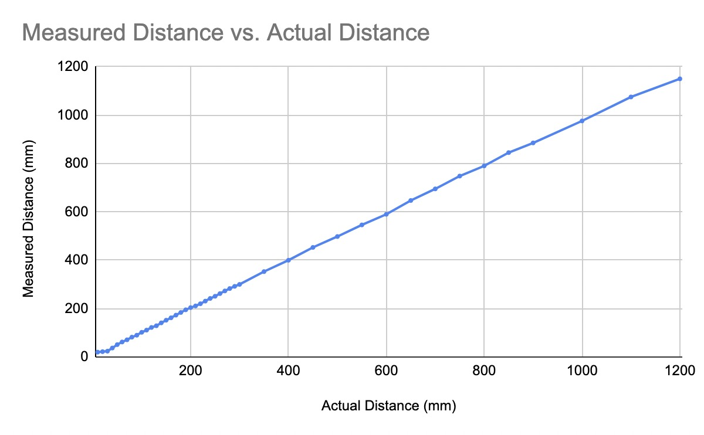
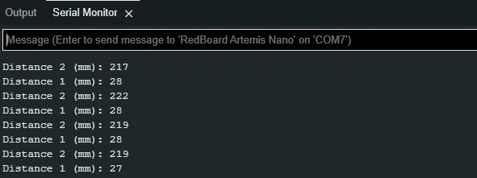
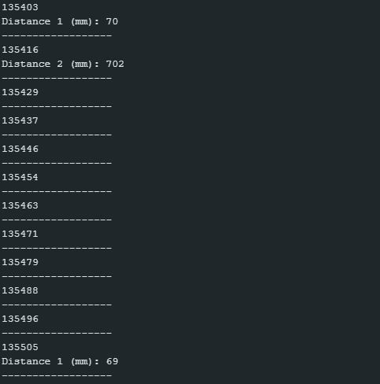

[Return to Main Page](https://themandrazic.github.io/)

## I. Summary
In this lab, the goal was to equip the robot with time of flight (ToF) sensors - the faster the robot can sample and the more it can trust a sensor reading, the faster it is able to drive.

---
## II. Prelab Requirements
### I2C Sensor Address
In order to start this lab, the first task necessary was discovering the I2C address that the RedBoard Artemis Nano recognized the Time of Flight (ToF) sensor as. To do this, I loaded up the example Artemis sketch named ***Example1_wire_I2C***. When this ran on the board it printed out the I2C address that was connected to the board which was **0x29** as shown in the below screenshot.



### Two ToF Sensors
After finding the address for the first sensor, I then needed to connect a second ToF sensor. To do this, I increased the address label up to 0x30 but this didn't work. After this I increased it to 0x31 which also didn't work but then the 0x32 address did read it properly.

In addition to using the proper address, I also needed to add some extra circuitry to the second sensor in order for it to be read. To do this, I soldered the XShut pin on one of the ToF sensors to a digital I/O pin on the Artemis (I chose pin 4). This was necessary because in order to read two sensors, one sensor needed to be shut off while the other sensor had its address set to 0x32.

### Placement of Sensors
For the final part of the prelab I considered the placement of the two ToF sensors. Since we would need to map out a maze, it makes sense that one ToF sensor would detect objects in front of the robot and the second ToF sensor would detect objects to the side of the robot. And because the robot can flip over, we can sense walls on both sides of the robot so long as one of the ToF sensors is on the side.

---
## III. Lab Tasks
### QWIIC breakout Board
In order to have two ToF sensors, I used a QWIIC breakout board that allowed for multiple I2C connections to the Artemis. Below are pictures of the breakout board setup and the data it was outputting to the serial monitor as I was testing its accuracy.




### Accuracy
I chose the long distance mode for the sensors because I believe this will be the best way to map out the maze with the final robot. If there is a long stretch in the maze, having an inaccurate measurement will throw off the robot significantly. So with the long mode set, I tested the accuracy of the sensor as shown below.


### Two ToF sensors
As I discussed in the prelab section, adding two ToF sensors required using an Artemis digital I/O pin. I chose pin 4 because it was an open pin on the Artemis that wasn't an analog pin. This is important because analog pins should ideally be saved for analog sensors since there are fewer of them than digital pins. <br/>

After this had been set up, I needed to expand the demo code for one ToF sensor so that it could read two ToF sensors. In order to do this, I instantiated a second object of the distance sensor and then shut it down so that I could reset the address of the first ToF sensor. This was done using the following code:
 ```C
// Shutdown distanceSensor2 and change the address of distanceSensor1
pinMode(4, OUTPUT);
digitalWrite(4, LOW);
distanceSensor1.setI2CAddress(0x32);
digitalWrite(4, HIGH);
 ```
With both sensors properly set up, all I needed to do was test it. The below video shows both distance sensors actively reading the distance!
<iframe width="560" height="315" src="https://www.youtube.com/embed/tjK_hkgxSuI" title="YouTube video player" frameborder="0" allow="accelerometer; autoplay; clipboard-write; encrypted-media; gyroscope; picture-in-picture; web-share" allowfullscreen></iframe>



### ToF Sensor Speed
As it will be important in the final robot, my next task was to allow the rest of my code to execute while the ToF sensors were waiting for their data reads. Seeing as my robot will have other sensors and functions, I can't let my code hang while it waits for the ToF sensors to finish their measurements. I also wanted to measure how long each data read took and if the distance affected how long the measurement took. I wrote the following code snippet to do this:
```C
void loop(void)
{
  distanceSensor1.startRanging(); //Write configuration bytes to initiate measurement
  distanceSensor2.startRanging();
 
  // Print current time to serial monitor
  Serial.println("------------------");
  Serial.println(millis());
  // Check for Data ready
  if (distanceSensor1.checkForDataReady()){
      int distance1 = distanceSensor1.getDistance(); //Get the result of the measurement from the sensor
      distanceSensor1.clearInterrupt();
      distanceSensor1.stopRanging();
 
      Serial.print("Distance 1 (mm): ");
      Serial.println(distance1);
  }
  if (distanceSensor2.checkForDataReady()){
      int distance2 = distanceSensor2.getDistance();
      distanceSensor2.clearInterrupt();
      distanceSensor2.stopRanging();
 
      Serial.print("Distance 2 (mm): ");
      Serial.println(distance2);
  }
}
```
The below picture shows what was printed to the serial port.


As we saw in the above picture and what I witnessed by looking through even more data, was that the read time of the sensor and the distance of the read were only slightly correlated. For reads up to ~650mm, the acquisition time was the same as reads that were very small. For reads over this, it then took extra time. I noticed, however, that the reads took ~100ms for small reads and ~200ms for the larger reads. I'm not sure why this is but maybe it has to do with calculation rates and the processor scheduling.

### Time vs Distance

---
## IV. Additional MEng Tasks
### Infrared Transmission Based Sensors
The ToF sensor that was used uses infrared light to determine the depth/distance of the objects it hits. The ToF sensor emits a signal which then bounces off of an object and goes back to the sensor. The sensor measures the time it takes for the signal to return to the sensor is how the distance is determined. The advantages to ToF sensors are their small package size and the low sensitivity they have to the environment. This makes them very good for environments that are prone to change and for purposes that require a small form factor. There are disadvantages to ToF sensors, however. The two main disadvantages are cost and sampling frequency. ToF sensors are not cheap and can quickly become expensive if a lot of sensors are needed. The sampling frequency is relatively slow compared.<br/>
There are also amplitude based sensors which use the amplitude of the returning signal to measure the distance instead of time like the IR sensors. Amplitude based infrared sensors are advantageous because they are small and cost effective. However, they are affected by environmental circumstances which makes them bad for applications that will see a wide variety of environments.

### Sensitivity of Sensors to Colors and Textures
Based on my findings, neither color nor texture affected the readings of the sensor. I tested a wide variety of colors (black, white, red, blue, green, and clear) and there was no evidence to show that color affected the sensors. As for texture, I could not find any material that changed the accuracy of the sensor. 

---
## V. Conclusion
Overall this was a pretty successful lab and I'm excited to keep slowly building on the robot so that it can be fully functional in the next few weeks!